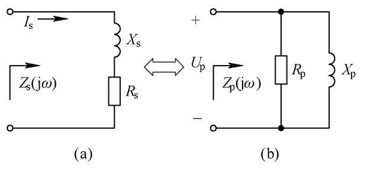
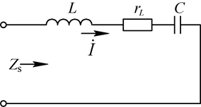

# 小信号选频放大器

## QUESTION

小信号放大器处于接收机什么位置

小信号放大器的电路如何构成？有哪些类型？

如何分析小信号选频放大电路？如何计算增益、带宽等参数

#### 2.1 LC谐振与阻抗变换电路

LC谐振回路是构成高频谐振放大器、正弦波振荡器及各种选频电路的基础电路，除了进行选频外，还进行信号的频幅转换和频相转换（在斜率鉴频和相位鉴频）以及组成阻抗变换和匹配电路。

##### 2.1.1 阻抗的串并联

有电阻元件和电抗元件组成的电路的串联形式与并联形式等效变换，保持其等效阻抗和Q值不变

$Z_s = R_s+jX_x$

$Z_p=\frac{R_pjX_p}{R_p+jX_p}=\frac{X_P^2}{R_P^2+X_p^2}R_P+j\frac{R_p^2}{R_p+X_p^2}X_P$

阻抗的并串联转换

$$
\left\{
\begin{array}{}
&R_s = \frac{X_P^2}{R_P^2+X_P^2}R_p\\
&X_s = \frac{R_P^2}{R_P^2+X_P^2}X_P
\end{array} \right.
$$

同理阻抗的串并转换

$$
\left\{
\begin{array}{}
&R_P = \frac{R_S^2+R_P^2}{R_S}\\
&R_S = \frac{R_S^2+R_P^2}{R_P}
\end{array}
\right.
$$

> Q：品质因素 无功功率和有功功率之比

> 并联电压相等，串联电阻相等

$Q=\frac{R_P}{X_P}=\frac{X_S}{R_S}$

故串并联变化的公式改为

$$
\left\{
\begin{array}{}
&R_p&=&(1+Q^2)R_S\\
&X_P&=&(1+\frac{1}{Q^2}）X_S
\end{array}
\right.
$$

> parallel:平行

转换之后电抗元件的性质没有改变

##### 串、并联回路的基本性质

串联谐振回路

